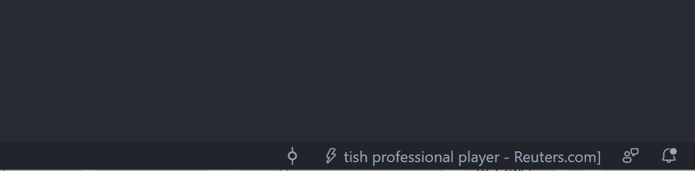

# News Headlines
It shows news headlines on the status bar. You can add news sources as RSS feed. The news is updated every three minutes in the background.

## Customization

Some customizations are available in Settings.
### newsSource
It only can accept RSS2.0. Here is the default setting.
```json
"newsheadlines.newsSource": [
    "https://news.google.com/rss/search?q=inurl:www.reuters.com&hl=en-US&gl=US&ceid=US:en",
    "https://news.google.com/rss/search?q=inurl:www.cnn.com&hl=en-US&gl=US&ceid=US:en",
]
```
### length
The length of the headline's characters on the status bar
```json
"newsheadlines.length": 40
```
The minimum value is `20`.

### showIntervalSeconds
Interval seconds to show a next news
```json
"newsheadlines.showIntervalSeconds": 30
```
The minimum value is `30`.
